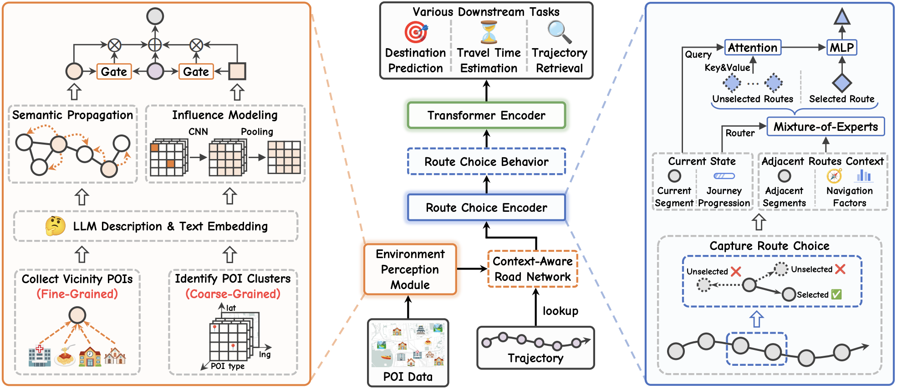

## <div align="center"> Capturing Context-Aware Route Choice Semantics for Trajectory Representation Learning </div>

<div align="center">
  <a href="https://arxiv.org/abs/2510.14819"></a>
</div>

### Overview

This is the official implementation of paper "Capturing Context-Aware Route Choice Semantics for Trajectory Representation Learning" [[arXiv](https://arxiv.org/abs/2510.14819)], which learns trajectory embeddings by incorporating context-aware route choice semantics as an inductive bias.

### Introduction

Trajectory representation learning (TRL) aims to encode raw trajectory data into low-dimensional embeddings for downstream tasks such as travel time estimation, mobility prediction, and trajectory similarity analysis. From a behavioral perspective, a trajectory reflects a sequence of route choices within an urban environment. However, most existing TRL methods ignore this underlying decision-making process and instead treat trajectories as static, passive spatiotemporal sequences, thereby limiting the semantic richness of the learned representations. To bridge this gap, we propose CORE, a TRL framework that integrates context-aware route choice semantics into trajectory embeddings. CORE first incorporates a multi-granular Environment Perception Module, which leverages large language models (LLMs) to distill environmental semantics from point of interest (POI) distributions, thereby constructing a context-enriched road network. Building upon this backbone, CORE employs a Route Choice Encoder with a mixture-of-experts (MoE) architecture, which captures route choice patterns by jointly leveraging the context-enriched road network and navigational factors. Finally, a Transformer encoder aggregates the route-choice-aware representations into a global trajectory embedding. Extensive experiments on 4 real-world datasets across 6 downstream tasks demonstrate that CORE consistently outperforms 12 state-of-the-art TRL methods, achieving an average improvement of 9.79% over the best-performing baseline. The overview of our framework is shown as below:



### Installation

#### Environment

* Tested OS: Linux
* Python >= 3.9

#### Dependencies

1. Install PyTorch with the correct CUDA version.
2. Use the `pip install -r requirements.txt` command to install all of the Python modules and packages used in this project.

### Usage Instructions

#### 1. Data Preparation

Please follow these steps to prepare your dataset:

1. Create a new directory for your dataset inside the `data/` directory.

2. Within your new dataset directory, create two subdirectories: `poi/` and `traj/`.

3. Place your data files (e.g., `poi.csv`, `roadmap.geo`, `roadmap.rel`, `trajectory_*.csv`) into the corresponding subdirectories. For details on the specific function and placement of each file, please refer to the example structure for the `Beijing` dataset in the Code Structure section above.

#### 2. Data Preprocessing

```bash
cd data

python generate_road_freq.py --dataset <city_name>
python generate_road_network_info.py --dataset <city_name>
python generate_aug_traj_for_pretrain.py --dataset <city_name>
python generate_traj_sim_data.py --dataset <city_name>
python generate_path_rank_data.py --dataset <city_name>
```

#### 3. LLM Description & Text Embedding

```bash
cd llm_script

python generate_road_poi_data.py --dataset <city_name>
python generate_road_poi_prompt.py --dataset <city_name>
python generate_road_poi_description.py --dataset <city_name>
python generate_road_poi_embedding.py --dataset <city_name>

python generate_grid_poi_data.py --dataset <city_name>
python generate_grid_poi_prompt.py --dataset <city_name>
python generate_grid_poi_description.py --dataset <city_name>
python generate_grid_poi_embedding.py --dataset <city_name>
```

#### 4. Model Pre-Training

```bash
python pretrain.py --dataset <city_name>
```

#### 5. Running Downstream Tasks

**Road Label Prediction:**

```bash
python train_road_label.py --dataset <city_name>
```

**Trajectory Destination Prediction:**

```bash
python train_des_pred.py --dataset <city_name>
```

**Travel Time Estimation:**

```bash
python train_tte.py --dataset <city_name>
```

**Similar Trajectory Retrieval:**

```bash
python run_traj_sim.py --dataset <city_name>
```

**Path Ranking:**

```bash
python train_path_rank.py --dataset <city_name>
```

**Trajectory Generation:**

Please refer to [caoji2001/HOSER](https://github.com/caoji2001/HOSER).
